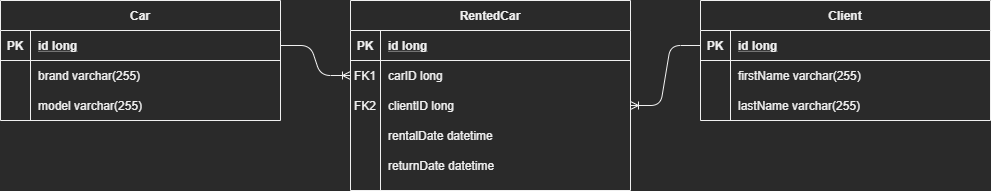

## Car Rental Project
### About
It is a simple backend api of car rental service written in Java with use of Hibernate Framework
and Spark framework with a simple database in SQLite.

Api provides: adding, editing, deleting, fetching cars as well as users.
Single car can be rented once until return. Client can rent multiple cars, 
where history of rented cars is stored with rent and return date.

### Database Schema
The database is constructed of three tables with corresponding entities in code: Car, 
Client and RentedCar which is also presented in a schema below.

### Available Endpoints
Here is a list of all available endpoints with short descriptions. 
Testing requests for Postman can be found [here]()

All routes have a root path `/api` meaning that accessing for e.g. resource `x` would be described by `http://url.com/api/x`

All responses have `Content-Type` set to `aplication/json`, and all specified `4XX` responses have json message.

Deleting client or car will delete all of their history.

`GET /car` - return all cars stored with code `200` or empty array if none found.

`GET /car/:id`- returns car specified by `:id` with code `200` or `404` if car not found.

`POST /car` - adds new car using query parameters `brand` and `model`, returns code`201` with created resource or `400` if invalid parameters were set.

`PATCH /car/:id` - updates existing car specified by `:id` using query parameters `brand` and `model`, returns `200` with resource or `404` if car not found.

`DELETE /car/:id` - removes car specified by `:id`, returns `204` or `404` if car not found.

`GET /client` - return all clients with code `200` or empty array if none found. If given query parameters `firstName` and `lastName` will lookup for record and return `200` if found or `404` if not.

`GET /client/:id` - return client specified by `:id` with code `200` or `404` if client not found.

`POST /client` - adds new client using query parameters `firstName` and `lastName`, return code `201` with created resource or `400` if invalid parameters were set.

`PATCH /client/:id` - updates existing client specified by `:id` using query parameters `firstName` and `lastName`, returns `200` with resource or `404` if client not found.

`DELETE /client/:id` - removes client specified by `:id`, returns `204` or `404` if client not found.

`GET /rental` - return all rented cars history with code `200` or empty array if none found.

`GET /rental/:id` - returns a record specified by`:id` with code `200` or `404` if record not found.

`POST /rental` - rents a car using query parameters `carId` and `clientId`, returns `200` and a resource. Returns `404` if identifiers were wrong or `400` if selected car is already rented.

`POST /rental/:id` - return a car using `:id` given when renting car, returns `200` and updated record or `404` if record not found.

### Requirements

### Running

### Building